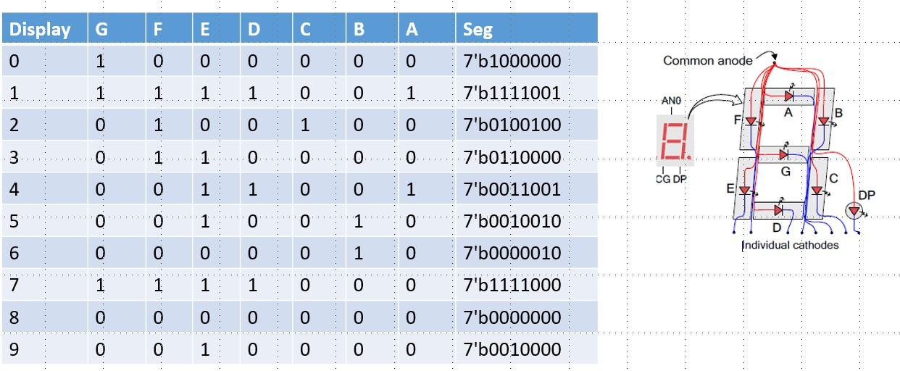

# 7-Segment Display in Digital Electronics

> A 7-segment display is an electronic display device widely used in digital electronics to show decimal numerals (0–9) and some basic characters. It consists of seven LED segments arranged in the pattern of the number "8" with each segment labeled from "a" to "g".



## Structure and Design

The seven-segment display consists of:

- Seven LED segments arranged in a figure-8 pattern
- Each segment is typically a rectangular LED designated by letters a–g
- Often includes an additional segment "dp" (decimal point)
- Segments are made from light-scattering material (often milky in color) to ensure uniform illumination

The segments are positioned as:

- Three horizontal segments (top, middle, bottom)
- Four vertical segments forming the sides

## Working Principle

The display works by selectively illuminating combinations of the seven segments to represent different characters:

- "0": a, b, c, d, e, f
- "1": b, c
- "2": a, b, g, e, d
- "3": a, b, g, c, d
- "4": f, g, b, c
- "5": a, f, g, c, d
- "6": a, f, g, e, c, d
- "7": a, b, c
- "8": a, b, c, d, e, f, g
- "9": a, b, c, d, f, g

## Types of 7-Segment Displays

### Based on Connection Configuration:

1. **Common Cathode (CC):**
    - All cathodes are connected to ground (logic 0)
    - Segments activate with a HIGH (logic 1) signal
2. **Common Anode (CA):**
    - All anodes are connected to power supply (logic 1)
    - Segments activate with a LOW (logic 0) signal

# 7 Segment Display Decoder

## Design Code For Counter

```verilog

        module counter_3bit_sevenseg(count,clk,rst);
        input clk,rst;
        output reg [2:0]count;
        integer i;
        always@(posedge clk, posedge rst)
        begin
        if(rst)
        count<=0;
        else 
        for(i=0;i<7;i=i+1)
        count<=count+1;
        end         
    
```

## Counter Test Bench

```verilog

        //counter test stimulus
        module counter_3bit_sevenseg_tb;
        reg clk,rst;
        wire [2:0] count;
        counter_3bit_sevenseg uut(count,clk,rst);
        initial begin
        clk = 0;
        forever #5clk=~clk;
        end
        initial begin
        rst=1;
        #10 rst=0;
        #1000000000 $stop;
        end
        endmodule            
    
```

## Design Code For 7 Segment Decoder

```verilog

        module segment7(bcd, seg );
        //Declare inputs, outputs and internal variables.
            input [3:0] bcd;
            output [6:0] seg;
            reg [6:0] seg;
       //always block for converting bcd digit into 7 segment format
           always @(bcd)
           begin
       case (bcd) //case statement
       0 : seg = 7'b1000000;
       1 : seg = 7'b1111001;   
       2 : seg = 7'b0100100;
       3 : seg = 7'b0110000;
       4 : seg = 7'b0011001;
       5 : seg = 7'b0010010;
       6 : seg = 7'b0000010;
       7 : seg = 7'b1111000;
       8 : seg = 7'b0000000;
       9 : seg = 7'b0010000;
       //switch off 7 segment character when the bcd digit is not a decimal number.
                   default : seg = 7'b1111111; 
               endcase
           end endmodule    
    
```

## Clock Divider Code

```verilog

        module clockdivide(clk, nclk);
        input clk;
        output reg nclk;
        reg [31:0]count=32'd0;
        always@(posedge clk)
        begin
        count=count+1;
        nclk=count[25];
        end
        endmodule         
    
```

## Main Code

```verilog

        module main_counter_3bit_sevenseg(seg,rst,clk);
        input rst, clk;
        output [6:0]seg;
        wire [2:0]count;
        wire nclk;
        wire [3:0]bcd;
        assign bcd={1'b0,count};
        counter_3bit_sevenseg u1(count,nclk,rst);
        clockdivide u2(clk, nclk);
        segment7 u3(bcd,seg);
        Endmodule           
    
```

## Top Module

```verilog

        module sevensegment_top(an,clk,rst,seg);
        input rst,clk;
        output [6:0]seg;
        output reg [7:0]an=8'b11111110;
        main_counter_3bit_sevenseg uut(seg,rst,clk);
        endmodule        
    
```