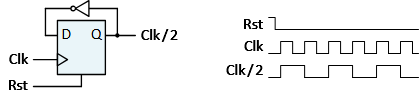
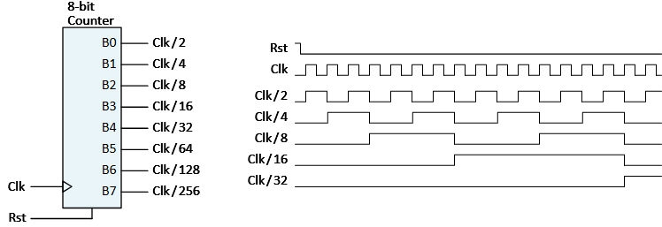
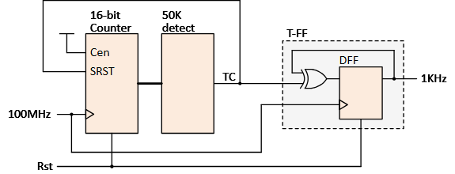

# Clock Divider Circuits: A Comprehensive Guide

Clock divider circuits are fundamental components in digital systems that generate lower frequency clock signals from a higher frequency input clock source. They're essential for creating multiple timing signals from a single source, allowing different subsystems to operate at their optimal frequencies.

## What Are Clock Divider Circuits?

Clock divider circuits create lower frequency clock signals by counting input clock cycles and toggling an output signal after a specific count is reached. For example, a system with a 100MHz main clock might need additional clocks at 10MHz, 1KHz, or other frequencies for different components.

Most digital systems require multiple clock frequencies to operate efficiently. Rather than using separate oscillator circuits for each frequency (which would be expensive and impractical), designers use clock divider circuits to derive all necessary clock signals from one or two main clock sources.

## Types of Clock Divider Circuits

### Simple Divide-by-2 Circuit



The simplest form of a clock divider uses a single flip-flop to divide the input frequency by 2. Each time the input clock transitions from low to high (positive edge), the output toggles its state, creating a new clock signal with half the original frequency.

```verilog
module dividebytwo (
    input clk, rst,
    output reg clk_div
);

always @ (posedge(clk), posedge(rst))
begin
    if (rst) clk_div <= 0;
    else clk_div <= !clk_div;
end
endmodule
```

This circuit toggles the output signal on every rising edge of the input clock, effectively halving the frequency.

### N-bit Counter-Based Dividers



An n-bit counter can produce multiple divided clock signals simultaneously. Each bit in the counter oscillates at half the frequency of the previous bit, creating a series of clock signals divided by powers of 2 (divide by 2, 4, 8, 16, etc.).

Here's how to implement an 8-bit counter that provides multiple clock divisions:

```verilog
module counter1(
    input clk, rst,
    output reg [7:0] counterout
);

always @ (posedge(clk), posedge(rst))
begin
    if (rst) counterout <= 0;
    else counterout <= counterout + 1;
end
endmodule
```

In this example, `counterout` oscillates at half the frequency of the input clock, `counterout[1]` at one-fourth, and so on.

### General Counter-Based Dividers



For more precise division ratios (not just powers of 2), a counter can be designed to count to a specific value, toggle an output, and reset itself. This creates a free-running clock divider that can divide by any integer value.

Here's a Verilog implementation that divides an input clock by 50,000:

```verilog
module ClkDivider (
    input clk, rst,
    output reg clk_div
);

localparam terminalcount = (25000 - 1);
reg [15:0] count;
wire tc;

assign tc = (count == terminalcount); // Compare counter with terminal count

always @ (posedge(clk), posedge(rst))
begin
    if (rst) count <= 0;
    else if (tc) count <= 0; // Reset counter at terminal count
    else count <= count + 1;
end

always @ (posedge(clk), posedge(rst))
begin
    if (rst) clk_div <= 0;
    else if (tc) clk_div = !clk_div; // Toggle output at terminal count
end
endmodule
```

This circuit counts to 24,999 (which is 25,000-1), toggles the output, and resets the counter. The output completes one cycle after 50,000 input clock cycles, effectively dividing the frequency by 50,000.

## FPGA Implementation Considerations

In FPGA systems, clock signals that drive flip-flops can only come from two sources:

1. The main clock input
    
2. Directly from the output of another flip-flop
    

This is an important constraint - clock signals cannot come from regular logic gates or combinational circuits in FPGAs. This restriction exists to maintain proper timing and prevent timing hazards.

## Real-World Applications

Digital systems typically require multiple clock frequencies for different subsystems. For example:

- 48KHz for audio processing
    
- 1KHz for timer circuits
    
- 10MHz for processor operations
    
- 12KHz for motor controllers
    

By using clock dividers, all these frequencies can be derived from a single main clock (like the 100MHz clock in the Blackboard example).

When calculating the division factor, remember that:

- The terminal count value should be half the total division factor (since the output spends half the time high and half low)
    
- The actual count value used is (terminal count - 1) because counting starts from 0
    

For example, to create a 2KHz clock from a 100MHz source, you need a division factor of 50,000 (100MHz ÷ 2KHz) and a terminal count of 25,000 (actually set to 24,999 in the code).

Clock dividers are essential building blocks that help digital systems manage their timing needs efficiently while minimizing the need for external components.