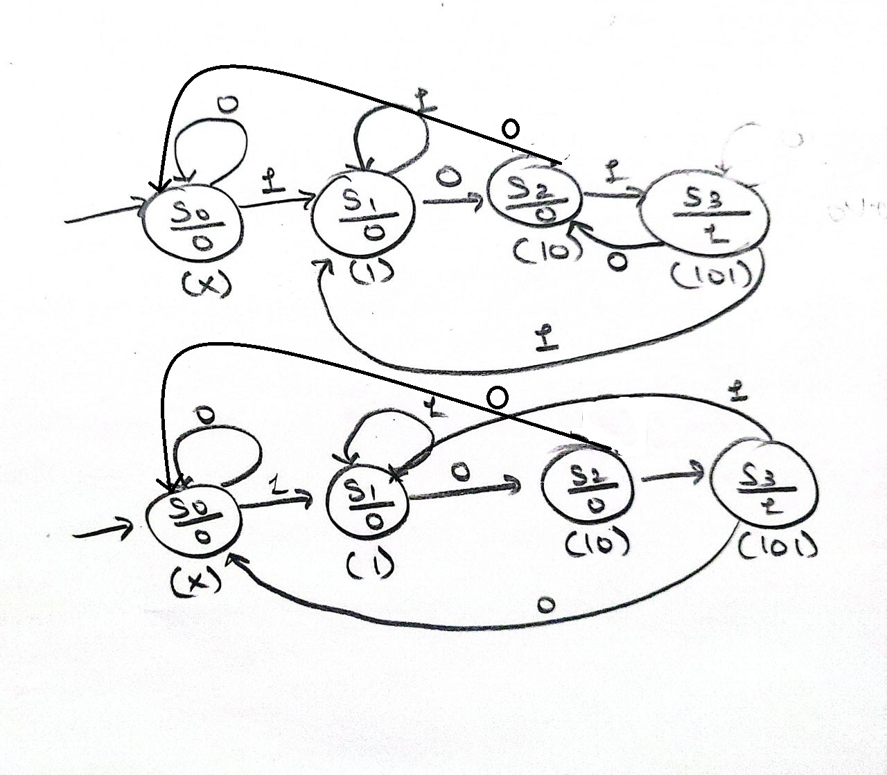
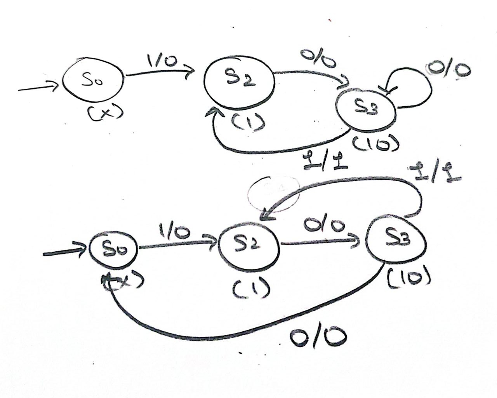

# Mealy and Moore Finite State Machines

## Mealy Machine

> A Mealy machine is a finite-state machine where the output depends on both the current state and the current input.

## Moore Machine

> A Moore machine is a finite-state machine where the output values depend solely on the current state, regardless of the input.

# Sequence Detectors

### Overlapping Sequence Detectors

> In an overlapping sequence detector, the final bits of one detected sequence can serve as the beginning bits of the next sequence. After detecting a pattern, the machine keeps the last bits that might be the start of a new pattern

- For a 101 sequence detector with input 0110101011001.
- The output is 0100100010000.
- After detecting 101, the last bit (1) can be the first bit of the next 101 pattern

### Non-Overlapping Sequence Detectors

> In a non-overlapping sequence detector, after a sequence is detected, the machine starts searching for a new sequence from scratch. After detecting a pattern, the machine returns to its initial state, discarding any potential overlap.

- For a 101 sequence detector with input 0110101011001.
- The output would be 0000100010000.
- After detecting 101, the machine resets and starts looking for a new pattern

| Feature | Mealy FSM | Moore FSM |
|---|---|---|
| **Output Dependence** | Depends on both state and current input | Depends only on current state |
| **Output Timing** | Changes immediately with input (can be faster) | Changes only on state change (synchronized) |
| **Number of States** | Usually fewer | Usually more |
| **Output Location** | On transitions (edges/arcs) | On states (nodes/circles) |
| **Example Output Timing** | Output can change in the middle of a clock cycle | Output changes only at clock edges |
| **Hardware Implementation** | May need less hardware | May need more hardware |
| **Suitability** | Good for fast response, compact design | Good for predictable, stable outputs |

# FSM

## Designing 101

### How to represent the states ?

#### For Moore

1. Make a circle.
2. Divide the circle horizontally.
3. Write the state name in the upper half.
4. Write the output in the lower half.
5. The input is write above the transition arrows.
6. Below the circle write the bit sequence covered by state.

Example: For S0

- The state is S0 write in upper half.
- The output is 0 write in lower half.
- Bellow the circle (x) initial state.

#### For Mealy

1. Make a circle.
2. Write the state name in the circle.
3. The input and output are write above the transition arrows.
4. On the right side of slash output and input on left.
5. Below the circle write the bit sequence covered by state.

Example: For S0

- The state is S0 write in circle.
- Bellow the circle (x) initial state.

### How to draw the arrow for next state ?

1. Write the present state.
2. Next state can be present state + 0 or 1.
3. For each possibility find the next state.
4. If the next state value is present in some other state then connect the arrow to that state.
5. If not then iteratively removed bits from left hand side till you find state.

Example: For S0

- Present state is 0.
- The next states are 01 and 00.
- For 01 the next state is S1.
- For 00 the next state is S0.

Example: For S3 (overlapping moore)

- Present state is 101.
- The next states are 1011 and 1010.
- For both the next state is ?

1. Find There is 1010 somewhere and connect.
2. No, Then remove one bit from the left 010. Now find if there any matching state.
3. No, Again repeat it till we get 10 which is available at S2.
4. similarly for 1011 to S1

### How to write the last state for overlap ping and non overlapping ?

1. For overlapping we can use the previous sate bits.
2. For non overlapping we can't use the previous sate bits, we only use the input.

**Note:** S0 is the initial state and doesnot represent sequence's fist bit.

# Moore Code and State Diagram




Overlapping (1) and Non Overlapping (2)

## Code for Non Overlapping Moore

```verilog

module Moore(x,clk,out);
input x,clk;
output reg out=0;
reg [1:0]state=2'b00;
always @(posedge clk)
    case(state)
        2'b00:begin
        if(x==1)
            begin
                state=2'b01;
            end
        out=0;
        end
        2'b01:begin
        if(x==0)
            begin
                state=2'b10;
            end
        out=0;
        end
        2'b10:begin
        if(x==1)
            begin
                state=2'b11;
            end
        out=0;
        end
        2'b11:begin
        if(x==1)
            begin
                state=2'b01;
            end
        else if(x==0)
            begin
                state=2'b00;
            end
        out=0;
        end
    endcase
endmodule
  
```

## Code for Overlapping Moore

```verilog

module Moore(x,clk,out);
input x,clk;
output reg out=0;
reg [1:0]state=2'b00;
always @(posedge clk)
    case(state)
        2'b00:begin
        if(x==1)
            begin
                state=2'b01;
            end
        out=0;
        end
        2'b01:begin
        if(x==0)
            begin
                state=2'b10;
            end
        out=0;
        end
        2'b10:begin
        if(x==1)
            begin
                state=2'b11;
            end
        out=0;
        end
        2'b11:begin
        if(x==1)
            begin
                state=2'b01;
            end
        else if(x==0)
            begin
                state=2'b10;
            end
        out=0;
        end
    endcase
endmodule
  
```

# Mealy Code and State Diagram



Overlapping (1) and Non Overlapping (2)

## Code for Non Overlapping Moore

```verilog

module mealy(x,clk,out);
input x,clk;
output reg out=0;
reg [1:0]state=2'b00;
always @(posedge clk)
    case(state)
        2'b00:begin
        if(x==1)
            begin
            state=2'b01;
            end
            out=0;
        end
        2'b01:begin
        if(x==0)
            begin
            state=2'b10;
            end
            out=0;
        end
        2'b10:begin
        if(x==1)
            begin
            state=2'b01;
            out=1;
            end
        else
            begin
            state=2'b00;
            end
            out=0;
        end
    endcase
endmodule
  
```

## Code for Overlapping Moore

```verilog

module mealy(x,clk,out);
input x,clk;
output reg out=0;
reg [1:0]state=2'b00;
always @(posedge clk)
    case(state)
        2'b00:begin
        if(x==1)
            begin
            state=2'b01;
            end
            out=0;
        end
        2'b01:begin
        if(x==0)
            begin
            state=2'b10;
            end
            out=0;
        end
        2'b10:begin
        if(x==1)
            begin
              state=2'b01;
              out=1;
            end
            else
            begin
              state=2'b00;
            end
            out=0;
        end 
    endcase
endmodule
  
```